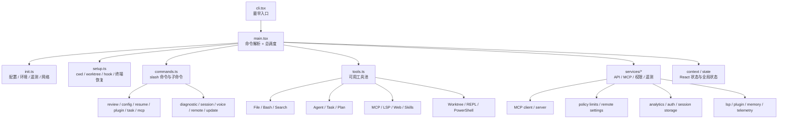
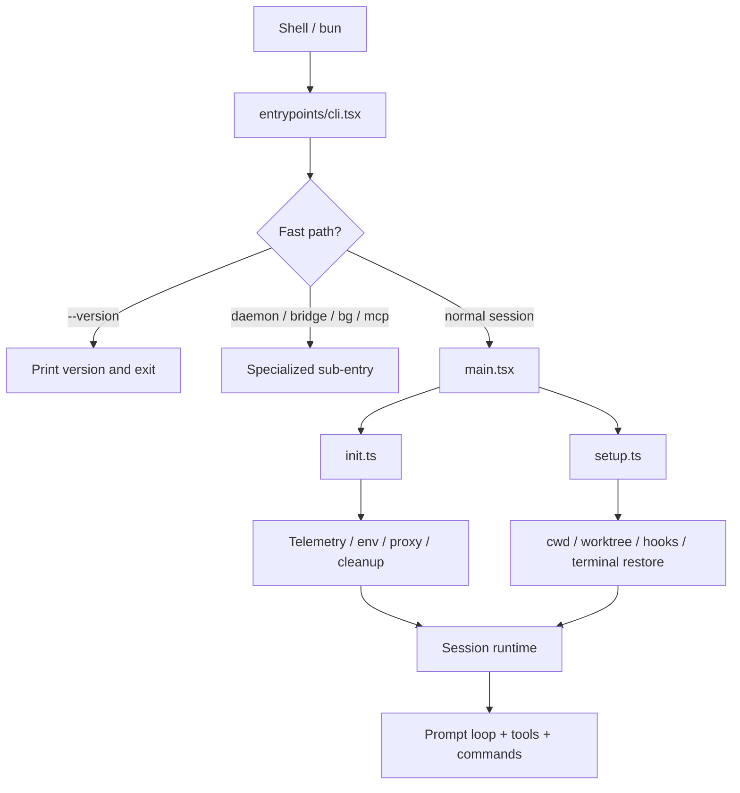
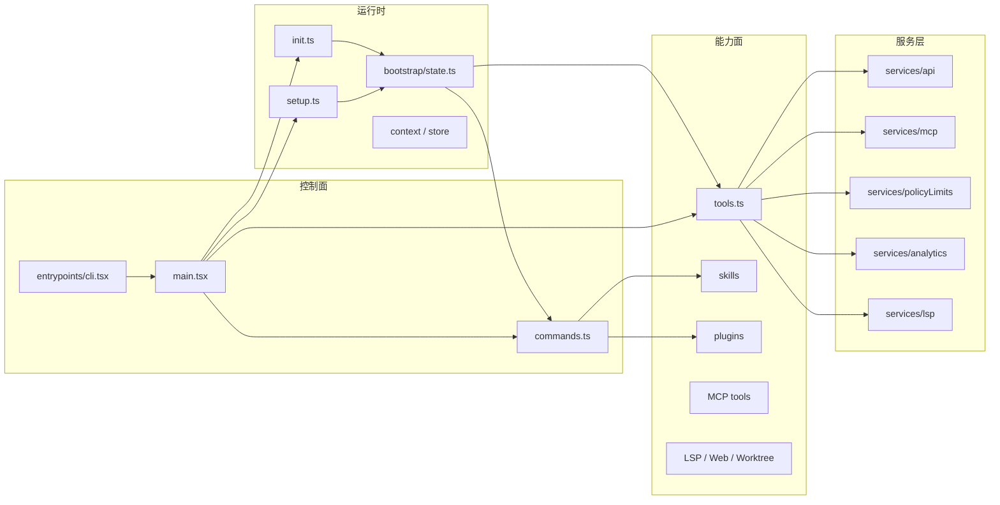
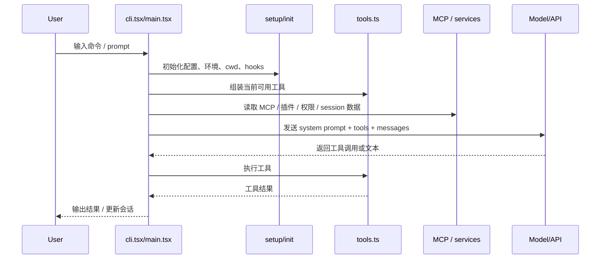
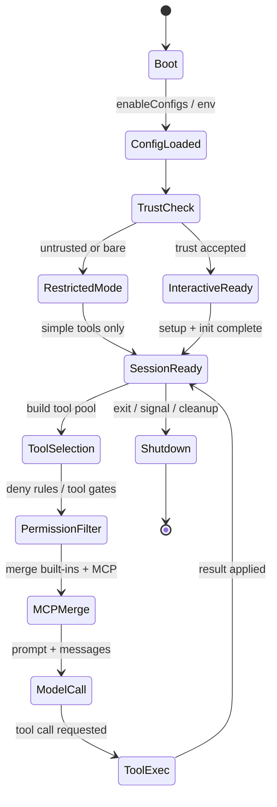

# Claude Code Sourcemap Architecture

这份文档基于 `@anthropic-ai/claude-code@2.1.88` 的 source map 还原结果整理，目标是把这个仓库的主启动链路和核心模块关系画清楚。

## 总体结构

这个项目本质上是一个终端里的 agent runtime，不是单纯的聊天 CLI。它把「命令行入口」「会话/状态管理」「工具系统」「MCP 连接」「插件与 skills」「远程与工作区能力」放在同一个运行时里，由 `main.tsx` 统一调度。



## 启动链路

1. `entrypoints/cli.tsx` 做最早的分流，先处理像 `--version`、`daemon`、`bridge`、`bg` 这类快速路径。
2. 绝大多数场景进入 `main.tsx`，这里负责解析参数、决定是否进入交互式会话、是否启用 assistant / plan / worktree / remote 等模式。
3. `init.ts` 负责“环境准备”，包括配置启用、安全环境变量、证书/代理、遥测、关闭清理等。
4. `setup.ts` 负责“会话准备”，包括当前目录、hooks、worktree、tmux、终端 backup 恢复等。
5. 之后由 `main.tsx` 进入主循环，把用户输入、命令、工具调用、MCP 资源、模型请求串起来。



## 核心分层

### 1. 命令层

`commands.ts` 汇总了大量 slash 命令和子命令。它更像“控制面”，负责会话管理、插件管理、诊断、导出、resume、review、mcp、task、voice、remote 等。

### 2. 工具层

`tools.ts` 是“能力面”的总入口。它根据环境变量、feature flag、权限上下文、模式开关，拼装出当前会话可见的工具池。

它大致分成几类：

- 文件与 shell：`BashTool`、`FileReadTool`、`FileEditTool`、`FileWriteTool`
- 检索与分析：`GrepTool`、`GlobTool`、`WebSearchTool`、`WebFetchTool`
- 任务与代理：`AgentTool`、`TaskCreate/Update/List/Get`、`TodoWriteTool`
- 扩展能力：`MCPTool`、`LSPTool`、`SkillTool`、`ConfigTool`
- 环境特化：`REPLTool`、`PowerShellTool`、`Worktree`、`Cron`

### 3. 服务层

`services/*` 里放的是可复用能力：API 客户端、MCP 客户端/服务端、权限策略、遥测、远程管理、会话存储、LSP、插件等。

### 4. 状态层

`bootstrap/state.ts` 是关键的全局状态中心，保存当前 session、cwd、model、权限、遥测计数器、plugin/skill/agent 状态、MCP 相关上下文等。这个文件很重要，也意味着项目有较强的“进程内单例”设计。

## 模块关系



## 关键数据流



## 权限与状态流转



### 这张图怎么读

- `TrustCheck` 决定是否可以启用完整能力集。
- `PermissionFilter` 控制哪些工具能进入模型上下文，哪些会被直接隐藏。
- `MCPMerge` 把内建工具和 MCP 工具合并，但仍然受 deny rules 约束。
- `SessionReady -> ModelCall -> ToolExec` 是主循环，状态会反复回到 `SessionReady`。

## 这套架构的特点

- 启动优化很强，很多路径都做了按需加载和 fast-path。
- 功能覆盖很广，已经接近“终端 agent 平台”。
- 工具、命令、MCP、插件、skills 是四个主要扩展面。
- 代价是全局状态和条件分支很多，理解成本高，维护时要非常注意启动顺序和 feature gate。

## 适合继续看的入口

- `restored-src/src/entrypoints/cli.tsx`
- `restored-src/src/main.tsx`
- `restored-src/src/setup.ts`
- `restored-src/src/entrypoints/init.ts`
- `restored-src/src/tools.ts`
- `restored-src/src/commands.ts`
- `restored-src/src/bootstrap/state.ts`

## Skills 加载链路

Claude Code 的 skills 分成两类：

- `bundled`：随 CLI 一起发布，启动时注册
- `dynamic`：从技能目录加载，来自用户、项目、插件或管理策略

```mermaid
flowchart TD
  A[main.tsx 启动] --> B[initBundledSkills()]
  B --> C[bundled/index.ts]
  C --> D[registerBundledSkill()]
  D --> E[bundledSkills registry]

  F[commands.ts / getCommands()] --> G[getDynamicSkills()]
  G --> H[loadSkillsDir.ts]
  H --> I[读取 skills / commands 目录]
  H --> J[解析 frontmatter]
  H --> K[合并 hooks / tools / model / agent]
  H --> L[registerMCPSkillBuilders()]
  L --> M[MCP 相关 skills]

  E --> N[最终 skills 列表]
  I --> N
  J --> N
  K --> N
  M --> N
```

### 这条链路怎么理解

- `bundled/index.ts` 是内置 skill 的注册清单，像 `verify`、`remember`、`updateConfig` 这类都从这里进来。
- `bundledSkills.ts` 负责把 skill 包装成统一的 `Command` 结构，并在必要时把参考文件抽到磁盘。
- `loadSkillsDir.ts` 负责扫描目录、读 frontmatter、做去重、过滤、参数解析和 hook 合并。
- `mcpSkillBuilders.ts` 负责把 MCP 相关技能构建逻辑接进 `loadSkillsDir.ts`，避免循环依赖。
