# Claude Code Sourcemap Tech Stack

这份文档整理这个项目实际用到的技术栈，按运行时、UI、AI、服务、工程化分层。

```mermaid
flowchart TD
  A[Runtime] --> A1[Bun]
  A --> A2[Node.js 18+]
  A --> A3[TypeScript / TSX]

  B[UI] --> B1[React]
  B --> B2[Terminal TUI / Ink-style components]
  B --> B3[Commander CLI]
  B --> B4[Chalk]

  C[AI] --> C1[Anthropic SDK]
  C --> C2[MCP]
  C --> C3[Skills / Tools / Agents]

  D[Services] --> D1[OpenTelemetry]
  D --> D2[LSP]
  D --> D3[Remote sessions / worktree]
  D --> D4[Plugins / config / policy]

  E[Engineering] --> E1[Lodash-es]
  E --> E2[Zod]
  E --> E3[Ignore / Gitignore matching]
  E --> E4[Source-map based reconstruction]
```

## 1. Runtime

- **Bun**: 入口里使用了 `bun:bundle`，说明项目支持 Bun 运行和打包路径。
- **Node.js 18+**: 包内明确要求最低 Node 18。
- **TypeScript / TSX**: 绝大多数源码是 `.ts` / `.tsx`，是这个项目的主语言。

## 2. UI

- **React**: 终端交互界面大量依赖 React 组件、hooks、context。
- **TUI 组件体系**: 这不是 Web UI，而是面向终端的交互界面。
- **Commander**: CLI 参数解析和子命令管理使用 Commander。
- **Chalk**: 负责终端彩色输出和提示样式。

## 3. AI

- **Anthropic SDK**: 模型请求、消息流、Beta 能力和工具调用都基于 Anthropic 官方 SDK。
- **MCP**: 通过 Model Context Protocol 接入外部工具和资源。
- **Skills / Tools / Agents**: 项目把能力拆成 skills、tools、agent 三层，构成 agent 运行时。

## 4. Services

- **OpenTelemetry**: 用于 metrics、tracing、logs 和启动性能分析。
- **LSP**: 集成语言服务器能力，提供代码理解和诊断。
- **Remote sessions / worktree**: 支持远程会话、后台会话、工作区切换。
- **Plugins / config / policy**: 插件、配置和权限策略是运行时的重要组成部分。

## 5. 工程化

- **Lodash-es**: 广泛用于 memoize、uniq、pick、filter 等常见操作。
- **Zod**: 用于配置、skill frontmatter、工具输入等结构化校验。
- **Ignore**: 用来做 gitignore 风格的路径匹配。
- **Source map reconstruction**: 当前仓库本身是从 npm 包和 source map 还原出的源码。

## 结论

这个项目的技术栈本质上是：

- 运行时：Bun + Node.js + TypeScript
- 界面：React + 终端 TUI + Commander + Chalk
- AI 能力：Anthropic SDK + MCP + skills/tools/agents
- 服务能力：OpenTelemetry + LSP + remote/session/plugin/policy
- 工程基础：Zod + Lodash + Ignore

